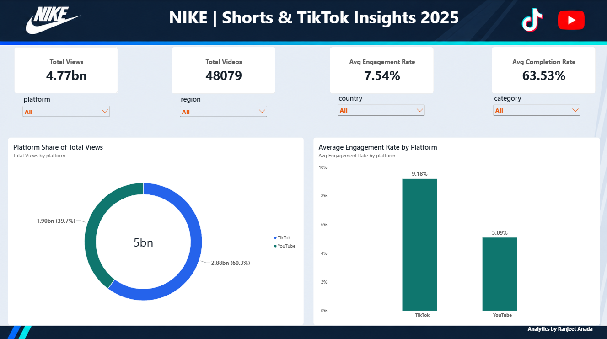
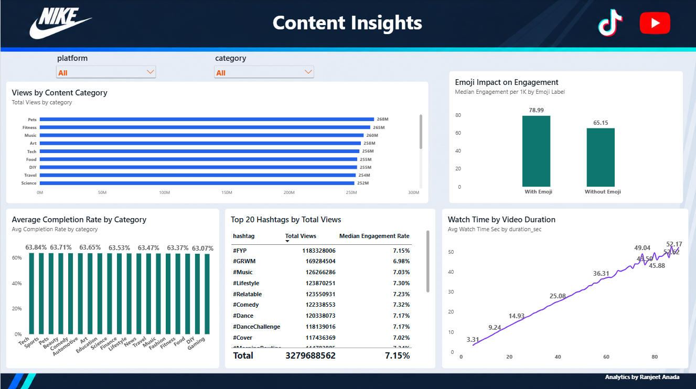
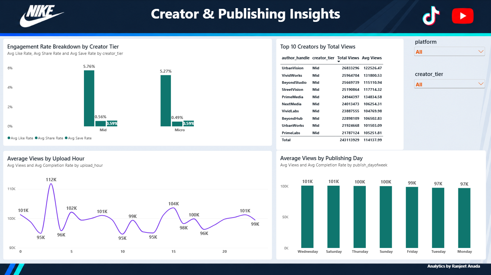
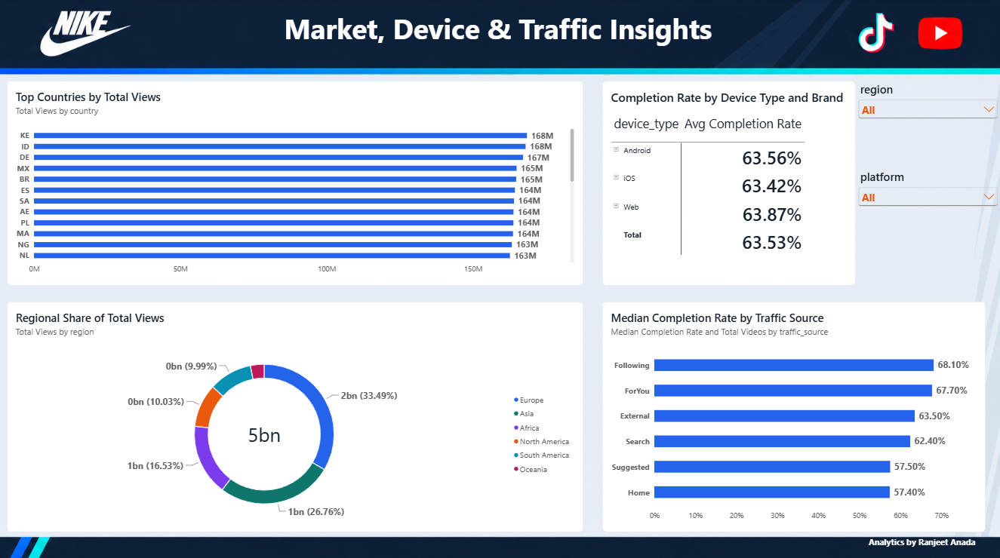
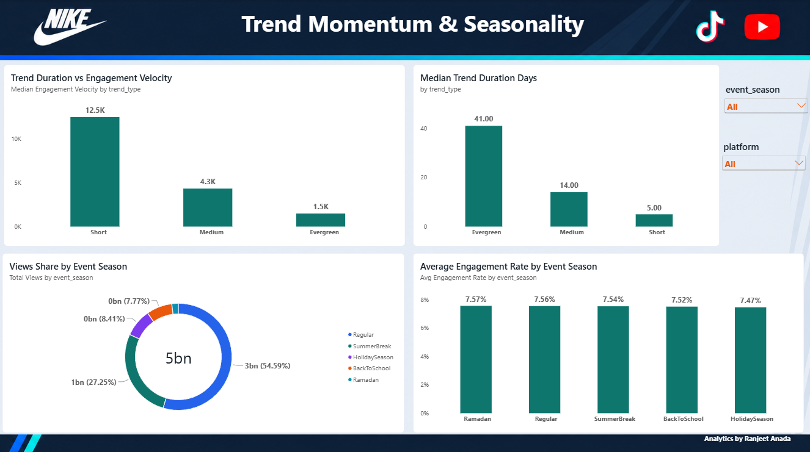

# Nike Digital Insights 2025

### YouTube Shorts & TikTok Business Analytics Project

An end-to-end **Data Analytics portfolio project** analyzing 2025 short-form video trends across **TikTok and YouTube Shorts** from the perspective of Nike's digital strategy.

The project combines **Python, MySQL, SQL, Power BI, DAX, data visualization, and business reporting** to transform short-form video trend data into meaningful business insights and strategic recommendations.

**Analytics by Ranjeet Anada**

---

## Project Overview

Short-form video plays an important role in digital marketing, creator partnerships, audience engagement, and trend-driven content strategies.

The objective of this project is to analyze short-form video performance and identify patterns across platforms, markets, content categories, creators, hashtags, publishing schedules, devices, traffic sources, trends, and seasonal periods.

The project was completed in three major stages:

1. **Python & MySQL** — Data import and database preparation
2. **SQL Analysis** — Business-focused analysis across 12 analytical questions
3. **Power BI** — Data modeling, DAX measures, interactive dashboards, and business insights

A final **Business Report** was also developed to translate the analytical results into executive-level recommendations.

> **Note:** This is a portfolio analytics project based on an external 2025 TikTok and YouTube Shorts trends dataset. It is analyzed from Nike's strategic perspective and should not be interpreted as verified first-party Nike campaign data.

---

## Business Objectives

The analysis focuses on the following business questions:

1. How do TikTok and YouTube Shorts compare in terms of total views and engagement?
2. Which countries generate the highest views on each platform?
3. Which content categories achieve stronger completion rates and watch time?
4. Which creators generate the strongest performance?
5. Which hashtags generate high reach and engagement?
6. Are emoji-led titles associated with stronger engagement?
7. Which publishing days and upload hours perform better?
8. How do engagement velocity and trend duration vary by trend type?
9. How does completion rate vary across devices and device brands?
10. Which traffic sources generate stronger completion rates?
11. How does content performance vary across event seasons?
12. Is the engagement data internally consistent?

---

## Dataset

The raw dataset is **not stored in this repository**.

The original dataset can be downloaded from the source below:

### Dataset Download

[Download the Original Dataset](https://wscubetechpvtltd-my.sharepoint.com/:u:/g/personal/ayushi_jain_wscubetech_com/IQAD1NvRrKqwXTw4A25maP-aAZ5ji45G4VvJBCLiSTexSUK?e=6KduUu)

### Dataset Overview

| Attribute | Details |
|---|---|
| Total Videos | **48,079** |
| Platforms | **TikTok & YouTube Shorts** |
| Analysis Period | **2025** |
| Main Metrics | Views, Engagement, Completion, Watch Time |
| Creator Data | Author Handle, Creator Tier |
| Content Data | Category, Hashtags, Emoji Usage |
| Market Data | Country, Region |
| Distribution Data | Traffic Source, Device |
| Trend Data | Trend Type, Velocity, Duration |
| Seasonal Data | Event Season |

The dataset includes metrics such as views, likes, comments, shares, saves, engagement rate, completion rate, average watch time, creator information, content categories, hashtags, publishing timing, traffic sources, devices, trend characteristics, and event seasons.

---

## Tools & Technologies

| Technology | Usage |
|---|---|
| **Python** | CSV-to-MySQL data import |
| **Pandas** | Data loading and preparation |
| **SQLAlchemy / PyMySQL** | Python-MySQL connectivity |
| **MySQL** | Database storage and analytical querying |
| **SQL** | Business analysis and data validation |
| **Power BI** | Data modeling and dashboard development |
| **DAX** | KPI and analytical measure creation |
| **GitHub** | Project documentation and portfolio presentation |

---

## Project Workflow

```text
Raw CSV Dataset
        │
        ▼
Python / Pandas
        │
        ▼
MySQL Database
        │
        ▼
SQL Business Analysis
        │
        ▼
Power BI Data Model
        │
        ▼
DAX Measures & Visualizations
        │
        ▼
Interactive Dashboards
        │
        ▼
Business Insights
        │
        ▼
Strategic Business Report
```

The dataset was imported into:

```text
Database: nike_insights_2025
Table: nike_videos
```

---

# Phase 1 — SQL Analysis

SQL was used to solve **12 business-focused analytical questions** from the project requirements.

### 1. Platform Comparison
Compared total views and average engagement rate across TikTok and YouTube Shorts.

### 2. Regional Hotspots
Identified the top five countries by total views for each platform.

### 3. Category Performance
Analyzed average completion rate and average watch time across content categories.

### 4. Creator Impact
Evaluated leading creators using average views and creator tier.

### 5. Hashtag Performance
Analyzed the top hashtags using total views and median engagement rate.

### 6. Emoji Effect
Compared median engagement per 1,000 views between titles with and without emojis.

### 7. Upload Timing
Analyzed average views and completion rate by publishing day and upload hour.

### 8. Trend Momentum
Compared median engagement velocity and trend duration across trend types.

### 9. Device Analysis
Analyzed completion rates by device type and device brand.

### 10. Traffic Sources
Compared traffic sources using video volume and median completion rate.

### 11. Seasonal Insights
Analyzed total views and engagement across event seasons.

### 12. Data Quality Validation
Validated whether:

```text
engagement_total = likes + comments + shares + saves
```

The validation did not identify mismatched rows in the analyzed dataset.

### SQL Files

**Complete SQL Analysis**

[`Nike_SQL_Analysis.sql`](SQL/Nike_SQL_Analysis.sql)

**Python Data Import Script**

[`import_nike.py`](SQL/import_nike.py)

---

# Phase 2 — Power BI Analysis

Power BI was used to transform the analytical results into an interactive business intelligence report.

The Power BI report contains **five dashboard pages**:

1. Executive Overview
2. Content Insights
3. Creator & Publishing Insights
4. Market, Device & Traffic Insights
5. Trend Momentum & Seasonality

### Power BI Files

**Power BI Project**

[`Nike_Insights_2025.pbix`](PowerBI_Analysis/Nike_Insights_2025.pbix)

**Dashboard PDF**

[`Nike_Insights_2025_Dashboard.pdf`](PowerBI_Analysis/Nike_Insights_2025_Dashboard.pdf)

---

# Dashboard 1 — Executive Overview

The Executive Overview provides a high-level summary of overall short-form video performance.

### Key KPIs

| KPI | Result |
|---|---:|
| **Total Views** | **4.77 Billion** |
| **Total Videos** | **48,079** |
| **Average Engagement Rate** | **7.54%** |
| **Average Completion Rate** | **63.53%** |

### Platform Performance

TikTok generated approximately:

- **2.88B total views**
- **60.3% of total view share**
- **9.18% average engagement rate**

YouTube Shorts generated approximately:

- **1.90B total views**
- **39.7% of total view share**
- **5.09% average engagement rate**

### Business Insight

TikTok leads both total view share and average engagement rate in the analyzed dataset, making it a strong platform for engagement-oriented short-form content testing.

YouTube Shorts remains valuable as part of a diversified platform strategy.



---

# Dashboard 2 — Content Insights

The Content Insights dashboard evaluates content categories, completion rates, hashtags, emoji usage, and video watch-time behavior.

### Category Performance

Leading categories by total views include:

| Category | Total Views |
|---|---:|
| Pets | **~268M** |
| Fitness | **~265M** |
| Music | **~260M** |
| Art | **~258M** |
| Tech | **~256M** |

Completion rates across categories are relatively close.

Examples of higher average completion rates include:

- Tech — **~63.84%**
- Sports — **~63.77%**
- Pets — **~63.73%**
- Beauty — **~63.71%**
- Comedy — **~63.66%**

### Hashtag Performance

`#FYP` generates approximately **1.18B total views**, making it the dominant hashtag by reach in the analysis.

However, reach alone should not be treated as a complete measure of hashtag effectiveness. Engagement should also be considered.

### Emoji Effect

| Title Type | Median Engagement per 1K |
|---|---:|
| **With Emoji** | **78.99** |
| **Without Emoji** | **65.15** |

Titles containing emojis show higher median engagement per 1,000 views in this dataset.

This represents an **association**, not proof that emojis directly cause higher engagement.

### Business Insight

Content strategy should combine reach, completion, engagement quality, and creative relevance rather than relying on a single performance metric.



---

# Dashboard 3 — Creator & Publishing Insights

This dashboard analyzes creator performance, creator tiers, engagement behavior, publishing days, and upload hours.

### Creator Performance

Leading creators by **Total Views** in the Power BI dashboard include:

| Creator | Total Views |
|---|---:|
| UrbanVision | **26.83M** |
| VividWorks | **25.96M** |
| BeyondStudio | **25.67M** |
| StreetVision | **25.19M** |
| PrimeMedia | **24.94M** |

> The Power BI dashboard ranks creators by **Total Views**, while SQL Question 4 separately evaluates creators by **Average Views per Video**. These metrics should not be interpreted as the same ranking.

### Creator Tier Engagement

**Mid-tier creators**

- Average Like Rate — **5.76%**
- Average Share Rate — **0.56%**
- Average Save Rate — **0.59%**

**Micro-tier creators**

- Average Like Rate — **5.27%**
- Average Share Rate — **0.49%**
- Average Save Rate — **0.59%**

### Publishing Day

Average views are strongest around:

- Wednesday — **~101K**
- Saturday — **~101K**
- Thursday — **~100K**
- Sunday — **~100K**

### Upload Hour

One of the strongest average-view peaks occurs around:

**03:00 — ~112K average views**

Other relatively strong hours include approximately:

- 15:00
- 05:00
- 00:00
- 22:00

### Business Insight

Creator selection should consider multiple dimensions, including total reach, average views per video, and engagement quality.

Publishing-time results should be treated as **testing windows rather than guaranteed best posting times**.



---

# Dashboard 4 — Market, Device & Traffic Insights

This dashboard analyzes geographic performance, regional distribution, device completion rates, and traffic-source behavior.

### Regional Share of Total Views

| Region | View Share |
|---|---:|
| Europe | **33.49%** |
| Asia | **26.76%** |
| Africa | **16.53%** |
| North America | **10.03%** |
| South America | **9.99%** |
| Oceania | **~3.20%** |

Europe and Asia together represent the majority of total views.

### Leading Countries

Some of the leading countries by overall total views include:

- Kenya (KE) — **~168M**
- Indonesia (ID) — **~168M**
- Germany (DE) — **~167M**
- Mexico (MX) — **~165M**
- Brazil (BR) — **~165M**

### Device Completion Rate

| Device | Average Completion Rate |
|---|---:|
| Web | **63.87%** |
| Android | **63.56%** |
| iOS | **63.42%** |

Completion rates are very similar across devices.

### Traffic Source Performance

| Traffic Source | Median Completion Rate |
|---|---:|
| Following | **68.10%** |
| ForYou | **67.70%** |
| External | **63.50%** |
| Search | **62.40%** |
| Suggested | **57.50%** |
| Home | **57.40%** |

### Business Insight

Traffic-source differences are more pronounced than device differences.

This suggests that distribution and discovery strategy may provide greater optimization opportunities than device-specific creative changes.



---

# Dashboard 5 — Trend Momentum & Seasonality

This dashboard evaluates how quickly trends generate engagement, how long they remain active, and how performance varies across event seasons.

### Trend Performance

| Trend Type | Median Engagement Velocity | Median Duration |
|---|---:|---:|
| Short | **~12.5K** | **5 days** |
| Medium | **~4.3K** | **14 days** |
| Evergreen | **~1.5K** | **41 days** |

### Business Interpretation

**Short trends** generate rapid engagement momentum but have a short lifespan.

**Evergreen trends** generate engagement more slowly but remain relevant for significantly longer.

**Medium trends** provide a middle ground between speed and longevity.

### Event Season View Share

| Event Season | View Share |
|---|---:|
| Regular | **54.59%** |
| Summer Break | **27.25%** |
| Holiday Season | **8.41%** |
| Back to School | **7.77%** |
| Ramadan | **~1.99%** |

Average engagement rates across event seasons are very close, approximately **7.47%–7.57%**.

Therefore, the analysis does not support treating any single season as a dramatic engagement winner.

### Business Insight

A balanced content portfolio can combine:

- **Short trends** for rapid reach and engagement
- **Evergreen content** for longer-term visibility
- **Medium trends** for balanced momentum and lifespan



---

# Key Business Insights

### 1. TikTok Leads Platform Engagement

TikTok contributes approximately **60.3% of total views** and records a substantially higher average engagement rate than YouTube Shorts in this dataset.

### 2. Category Completion Differences Are Small

Although categories differ in total reach, completion rates are tightly clustered. Category decisions should therefore consider audience relevance and creative objectives in addition to completion rate.

### 3. Hashtag Reach and Engagement Should Be Evaluated Together

`#FYP` generates exceptional reach, but hashtag selection should not rely on total views alone.

### 4. Emoji-Led Titles Are Worth Testing

Videos with emojis in their titles show higher median engagement per 1,000 views, making emoji usage a useful testing hypothesis.

### 5. Creator Selection Requires Multiple Metrics

Total views alone do not provide a complete view of creator performance. Average views and engagement quality should also be considered.

### 6. Distribution Strategy Matters

Following and ForYou traffic sources show stronger median completion rates than Home and Suggested traffic.

### 7. Device Differences Are Limited

Completion rates across Web, Android, and iOS are very similar, suggesting that device-specific optimization is currently a lower priority.

### 8. Trend Strategy Requires Balance

Short trends deliver fast momentum, while evergreen trends provide substantially longer relevance.

### 9. Seasonality Influences Volume More Than Engagement

View distribution differs significantly by season, while average engagement rates remain relatively stable.

---

# Strategic Recommendations

### 1. Prioritize TikTok for Engagement-Oriented Testing

Use TikTok as the lead environment for short-form creative experimentation while maintaining YouTube Shorts for platform diversification.

### 2. Build a Dual-Speed Content Strategy

Combine fast-reactive short trends with long-life evergreen content instead of relying entirely on one trend type.

### 3. Test Emoji-Led Titles

Use controlled creative testing to determine whether the observed engagement advantage remains consistent for relevant campaign content.

### 4. Optimize Hashtags Using Multiple Metrics

Evaluate hashtags using both reach and engagement rather than selecting them solely by total views.

### 5. Use Multi-Metric Creator Evaluation

Evaluate creators using:

- Total Views
- Average Views per Video
- Like Rate
- Share Rate
- Save Rate

### 6. Localize Content for Strong Markets

Use regional and country-level insights to guide localized creative testing and market-specific content strategies.

### 7. Prioritize Distribution Strategy

Focus optimization efforts on traffic sources and discovery pathways, where performance differences are larger than device-level differences.

### 8. Use Publishing Patterns as Test Windows

Use stronger publishing days and hours as starting points for experimentation rather than treating them as permanent posting rules.

### 9. Continue Performance Measurement

Track views, engagement, completion, watch time, creator performance, and trend velocity consistently to identify repeatable patterns.

---

# 30–60–90 Day Action Plan

## 0–30 Days — Test

- Establish baseline KPI benchmarks
- Launch TikTok-focused creative tests
- Test emoji vs non-emoji titles
- Test stronger publishing windows
- Evaluate high-reach hashtags against engagement quality

## 31–60 Days — Optimize

- Expand successful creative patterns
- Test a balanced mix of short and evergreen content
- Introduce market-specific content variations
- Compare creator performance using multiple metrics
- Review traffic-source performance

## 61–90 Days — Scale

- Scale consistently successful creative combinations
- Formalize creator evaluation criteria
- Build a repeatable content testing framework
- Strengthen market localization
- Establish ongoing performance monitoring
- Prepare the analytical foundation for future predictive modeling

---

# Business Report

A complete executive-level business report was developed from the SQL analysis and Power BI results.

The report translates the analytical findings into business interpretation and practical recommendations.

It includes:

- Executive Summary
- Business Context
- Data & Methodology
- Platform Performance
- Content & Creative Insights
- Creator & Publishing Strategy
- Market, Device & Traffic Strategy
- Trend Momentum & Seasonality
- Strategic Recommendations
- 30–60–90 Day Action Plan
- KPI Framework
- Limitations
- Final Business Conclusion

### View Final Business Report

[`Nike_Digital_Insights_2025_Business_Report.pdf`](Reports/Nike_Digital_Insights_2025_Business_Report.pdf)

---

# Repository Structure

```text
Nike-Digital-Insights-2025/
│
├── README.md
│
├── SQL/
│   ├── Nike_SQL_Analysis.sql
│   └── import_nike.py
│
├── PowerBI_Analysis/
│   ├── Nike_Insights_2025.pbix
│   └── Nike_Insights_2025_Dashboard.pdf
│
├── Screenshots/
│   ├── 01_Executive_Overview.png
│   ├── 02_Content_Insights.png
│   ├── 03_Creator_Publishing_Insights.png
│   ├── 04_Market_Device_Traffic_Insights.png
│   └── 05_Trend_Momentum_Seasonality.png
│
└── Reports/
    └── Nike_Digital_Insights_2025_Business_Report.pdf
```

---

# Project Limitations

- The dataset is an external short-form trend dataset and is not verified first-party Nike campaign data.
- The analysis is observational and does not establish causality.
- Financial ROI cannot be calculated because campaign spend, revenue, conversion, and creator-cost data are not included.
- Publishing-time patterns should be validated through controlled testing.
- Aggregate dashboard results may hide differences within individual markets, creators, or content segments.
- Machine-learning model results are not included in the current project deliverables.

---

# Future Scope

The project can be extended through:

- Viral trend prediction
- Creator performance modeling
- Engagement forecasting
- Content virality classification
- Campaign-level performance analysis
- Creator cost and financial ROI integration
- Controlled A/B testing
- Advanced Power BI performance monitoring
- Machine-learning-based trend prediction

---

# Author

## Ranjeet Anada

**Data Analyst | Portfolio Business Analytics Project**

**Analytics by Ranjeet Anada**

**Core Skills:**  
SQL • MySQL • Power BI • DAX • Python • Pandas • Excel • Data Analytics

**LinkedIn:**  
[linkedin.com/in/ranjeetanada](https://www.linkedin.com/in/ranjeetanada)

---

### Project Summary

This project demonstrates an end-to-end analytics workflow covering **data import, SQL analysis, data validation, Power BI modeling, DAX measures, dashboard development, business interpretation, and strategic recommendations** for short-form digital content analytics.
